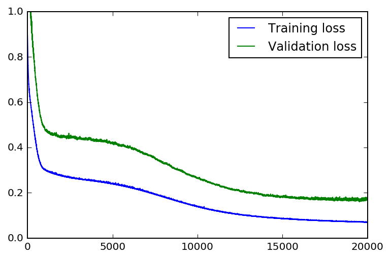
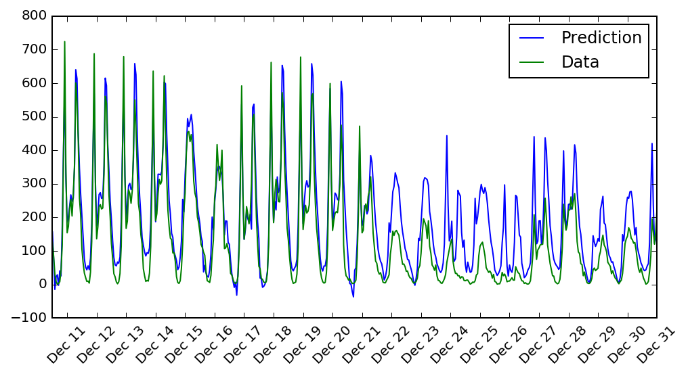
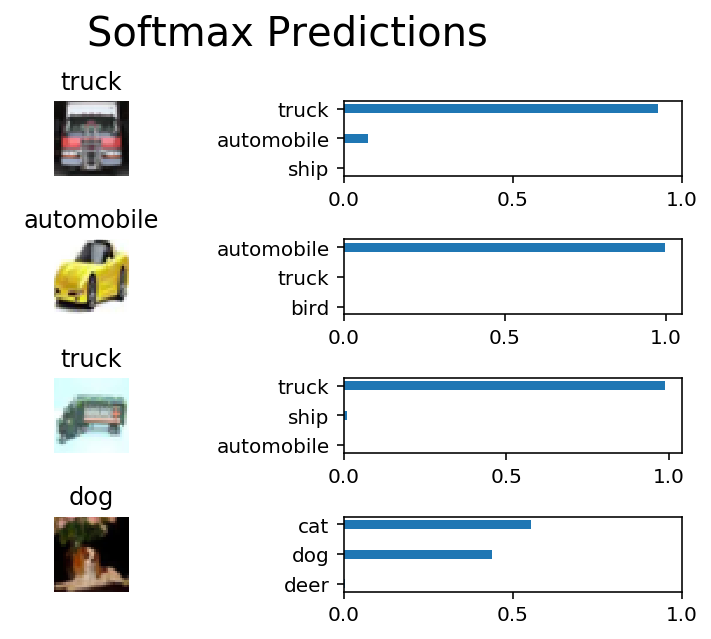
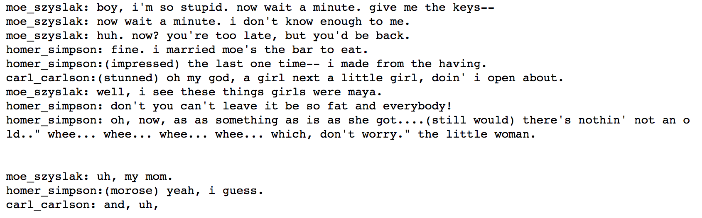
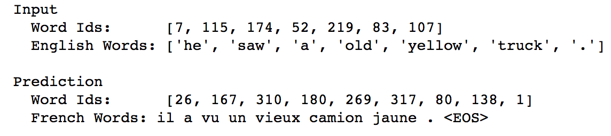
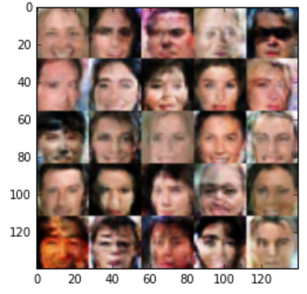

# Deep Learning Nanodegree Foundations

**Author**: Emilio Molina (emilio.mol.mar@gmail.com)

This repository contains:

- My solutions for the Deep Learning Nanodegree Foundations:
https://eu.udacity.com/course/deep-learning-nanodegree-foundation--nd101
- A brief summary of all projects (in this README.md)

## What I've learned in the nanodegree

A general overview on deep learning, and some hands-on experience with exercises and projects using Tensorflow. I think the content of the nanodegree can be summarized with the 5 delivered projects (and manually reviewed by Udacity).

## Projects

The solutions can be found in the different folders inside this repository. A brief summary:

### 1. Your first neural network

In this project you implement your own neural network **from scratch** using numpy. You implement not only the forward pass (prediction) but also the backpropagation algorithm (training). It is a very simple use case with a single hidden layer, but you obtain very interesting results (see figures).
 

 

### 2. Image classification using convolutional neural networks

Very interesting project where you use convolutional neural networks for implementing a image classifier (using CIFAR-10 dataset). Example of the achieved results:
 

### 3. Generate TV scripts using RNN

You use a recurrent neural network trained on TV scripts of **The Simpsons** to automatically generate a new one. This is the kind of script automatically generated:
 

### 4. English-to-French translation using deep learning
You use a recurrent neural network to implement a sequence-to-sequence system for language translation. Concretely, you use a dataset of english-to-french translation. Example of translation performed by the system:
 

### 5. Digits and faces generation using generative adversarial networks
This project is quite nice to understand GANs, and at the end of it you have a quite nice convolutional GAN able to generate almost-realistic faces. Check the results:
 

